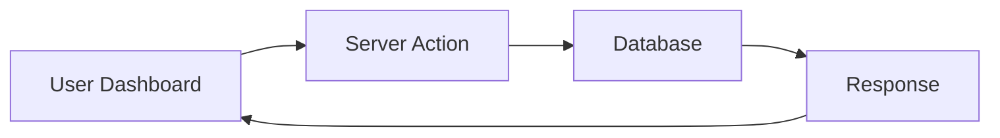
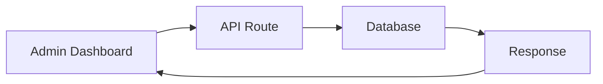

# Frontend-Backend Connection Architecture

## 🔗 **Overview**

This is a **full-stack Next.js application** where both frontend and backend are integrated into a single codebase using Next.js 14 App Router. The connection happens through multiple layers:

## 📁 **Project Structure**

```
app/
├── page.js                    # 🎨 Frontend: Home page
├── dashboard/
│   └── page.js               # 🎨 Frontend: Dashboard page
├── api/                       # 🔧 Backend: REST API routes
│   ├── todos/
│   │   ├── route.js          # 🔧 Backend: Todos CRUD API
│   │   ├── [id]/
│   │   │   └── route.js      # 🔧 Backend: Individual todo API
│   │   ├── search/
│   │   │   └── route.js      # 🔧 Backend: Search API
│   │   ├── export/
│   │   │   └── route.js      # 🔧 Backend: Export API
│   │   └── bulk/
│   │       └── route.js      # 🔧 Backend: Bulk operations API
│   └── auth/
│       └── [...nextauth]/
│           └── route.js      # 🔧 Backend: Authentication API
├── actions/                   # 🔧 Backend: Server Actions
│   ├── todos.js              # 🔧 Backend: Todo server actions
│   └── users.js              # 🔧 Backend: User server actions
└── layout.js                 # 🎨 Frontend: Root layout

components/                    # 🎨 Frontend: React components
├── dashboard/
│   ├── user-dashboard.js     # 🎨 Frontend: User dashboard
│   └── admin-dashboard.js    # 🎨 Frontend: Admin dashboard
└── ui/                       # 🎨 Frontend: UI components

lib/                          # 🔧 Backend: Shared utilities
├── db/
│   ├── index.js              # 🔧 Backend: Database connection
│   └── schema.js             # 🔧 Backend: Database schema
└── auth.js                   # 🔧 Backend: Authentication config
```

## 🔄 **Connection Methods**

### **1. Server Actions (Primary Method)**

**Frontend → Backend**: Direct function calls from React components to server functions.

```javascript
// Frontend (components/dashboard/user-dashboard.js)
import { createTodo, getTodos } from '@/app/actions/todos'

// Call server action directly
const result = await createTodo(formData)
const todos = await getTodos()
```

```javascript
// Backend (app/actions/todos.js)
'use server'

export async function createTodo(formData) {
  // Server-side logic
  const session = await getServerSession(authOptions)
  const newTodo = await db.insert(todos).values({...})
  return { success: true, todo: newTodo[0] }
}
```

**Advantages:**
- ✅ Type-safe
- ✅ No need to handle HTTP requests manually
- ✅ Automatic error handling
- ✅ Built-in validation
- ✅ Server-side rendering support

### **2. API Routes (REST API)**

**Frontend → Backend**: HTTP requests to API endpoints.

```javascript
// Frontend (components/dashboard/admin-dashboard.js)
const fetchAllTodos = async () => {
  const response = await fetch('/api/admin/todos')
  const data = await response.json()
  setTodos(data.todos)
}
```

```javascript
// Backend (app/api/admin/todos/route.js)
export async function GET() {
  const session = await getServerSession(authOptions)
  const allTodos = await db.select().from(todos)
  return NextResponse.json({ todos: allTodos })
}
```

**Advantages:**
- ✅ Standard REST API
- ✅ Can be called from external applications
- ✅ Supports all HTTP methods
- ✅ Good for third-party integrations

### **3. Database Connection**

**Backend → Database**: Direct database operations.

```javascript
// Backend (lib/db/index.js)
import { drizzle } from 'drizzle-orm/postgres-js'
import postgres from 'postgres'

const client = postgres(process.env.DATABASE_URL)
export const db = drizzle(client, { schema })
```

```javascript
// Backend (app/actions/todos.js)
import { db } from '@/lib/db'
import { todos } from '@/lib/db/schema'

const userTodos = await db.select().from(todos).where(eq(todos.userId, userId))
```

## 🔐 **Authentication Flow**

### **1. NextAuth.js Integration**

```javascript
// Frontend (app/layout.js)
import { getServerSession } from 'next-auth'
import { SessionProvider } from '@/components/providers/session-provider'

export default async function RootLayout({ children }) {
  const session = await getServerSession(authOptions)
  
  return (
    <SessionProvider session={session}>
      {children}
    </SessionProvider>
  )
}
```

```javascript
// Frontend (components)
import { useSession } from 'next-auth/react'

const { data: session } = useSession()
```

### **2. Server-Side Authentication**

```javascript
// Backend (app/actions/todos.js)
import { getServerSession } from 'next-auth'

export async function createTodo(formData) {
  const session = await getServerSession(authOptions)
  
  if (!session) {
    return { error: 'Unauthorized' }
  }
  
  // Continue with authenticated user
}
```

## 📊 **Data Flow Examples**

### **Example 1: Creating a Todo**



1. **Frontend**: User fills form and submits
2. **Server Action**: `createTodo(formData)` is called
3. **Backend**: Validates data, checks authentication
4. **Database**: Inserts new todo
5. **Response**: Returns success/error to frontend
6. **Frontend**: Updates UI with new todo

### **Example 2: Fetching Todos**


1. **Frontend**: Component mounts, calls `getTodos()`
2. **Server Action**: `getTodos()` is called
3. **Backend**: Checks authentication, queries database
4. **Database**: Returns user's todos
5. **Response**: Returns todos array
6. **Frontend**: Updates state and renders todos

### **Example 3: Admin API Call**



1. **Frontend**: Admin dashboard makes fetch request
2. **API Route**: `/api/admin/todos` handles request
3. **Backend**: Checks admin permissions, queries database
4. **Database**: Returns all todos with user info
5. **Response**: JSON response with todos
6. **Frontend**: Updates admin dashboard

## 🛡️ **Security Features**

### **1. Authentication**
- ✅ Server-side session validation
- ✅ Role-based access control
- ✅ Protected routes and API endpoints

### **2. Data Validation**
- ✅ Zod schema validation
- ✅ Input sanitization
- ✅ SQL injection prevention (Drizzle ORM)

### **3. Authorization**
- ✅ User-specific data access
- ✅ Admin-only operations
- ✅ Cross-user data protection

## 🚀 **Performance Optimizations**

### **1. Server-Side Rendering**
- ✅ Pages rendered on server
- ✅ SEO-friendly
- ✅ Fast initial load

### **2. Client-Side Updates**
- ✅ Real-time UI updates
- ✅ Optimistic updates
- ✅ Smooth user experience

### **3. Caching**
- ✅ Next.js built-in caching
- ✅ Database query optimization
- ✅ Static asset optimization

## 🔧 **Development Workflow**

### **1. Adding New Features**

1. **Frontend**: Create React component
2. **Backend**: Create server action or API route
3. **Database**: Update schema if needed
4. **Connect**: Wire frontend to backend
5. **Test**: Verify functionality

### **2. Debugging**

1. **Frontend**: Check browser console
2. **Backend**: Check server logs
3. **Database**: Check database queries
4. **Network**: Check API responses

## 📝 **Best Practices**

### **1. Server Actions vs API Routes**

**Use Server Actions for:**
- ✅ Internal application features
- ✅ Form submissions
- ✅ Data mutations
- ✅ Type-safe operations

**Use API Routes for:**
- ✅ External integrations
- ✅ Third-party services
- ✅ Public APIs
- ✅ Mobile app support

### **2. Error Handling**

```javascript
// Frontend
try {
  const result = await createTodo(formData)
  if (result.error) {
    toast({ title: 'Error', description: result.error })
  }
} catch (error) {
  console.error('Error:', error)
}
```

```javascript
// Backend
try {
  const newTodo = await db.insert(todos).values({...})
  return { success: true, todo: newTodo[0] }
} catch (error) {
  console.error('Database error:', error)
  return { error: 'Failed to create todo' }
}
```

This architecture provides a seamless full-stack development experience with Next.js, combining the best of both frontend and backend development in a single, cohesive application. 